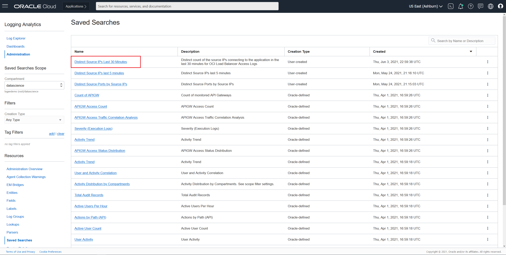
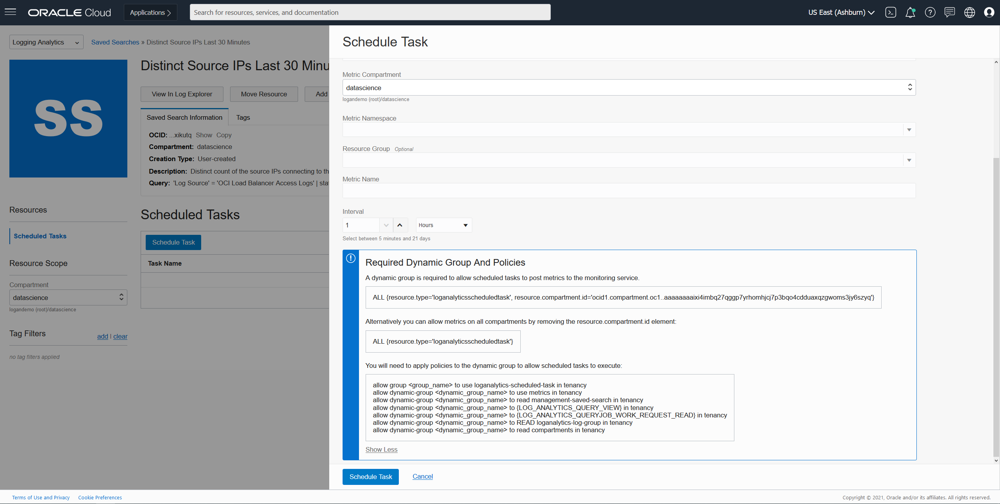

# Creating Saved Searches and Scheduled Searches, and Metrics

## Introduction

Now that you're logged into your Oracle Cloud Account. This lab will walk you through the steps of creating a Saved Search in Logging Analytics, followed by creating a Scheduled Task that posts metrics created by this search.

Estimated Lab Time: 30 mins

### Objectives

In this lab, you will:
* Create a saved search on log data (optionally add to dashboard)
* Create a saved search task for generating metrics
* Visualize metrics generated by saved search tasks

### Prerequisites

* An Oracle Cloud Environment

## **STEP 1**: Create a Saved Search On Log Data

If you already have a Saved Search you want to generate metrics with, skip to **STEP 2**

1. Navigate to Log Explorer in Logging Analytics
    
2. Expand the Scope Filter by clicking the icon next to the title "Log Explorer".
    
3. Choose the compartments for Log Group and Entity that contain the desired data. Then click Apply.
    
4. Click on the Time Selector.
    
5. Choose the desired time range for your query.
    
6. Write a query to filter the data, queries support complex operations and a deeper explanation of their usage is out of the scope of this lab, in this example we'll be using a simple query to count the distinct number of IPs trying to connect to our application from our OCI Load Balancer Access Logs. After creating a query, click "Run" to see the results.
    - ``'Log Source' = 'OCI Load Balancer Access Logs' | stats distinctcount('Source IP')``
    
7. (Optional) Under the visualizations sections, you can find and choose different options for how to view the data results.
    
8. Once you are satisfied with the data results, you can save all of your chosen options by clicking on the "Actions" button, and "Save as..."
    
9. You will be presented with a panel to create your Saved Search.
    
10. Enter the following information to create your new Saved Search.
    - Choose the compartment where the Saved Search will be created (This is not related to your query from the previous steps).
    - Enter a Name for your Saved Search.
    - Enter a Description for your Saved Search.
    - Check "Add to dashboard" if you would like to add the new Saved Search to a Dashboard (Optional).
    
11. (Optional) If you choose to add the new Saved Search to a Dashboard, you must select an alternative Dashboard from a compartment.
    
12. (Optional) Alternatively you can also create a new Dashboard to store the new Saved Search in.
    
13. Once you have entered all required fields (including Dashboard data if "Add to dashboard" is selected). Click on Save.
14. You will see a confirmation of your newly created resources.
    

## **STEP 2:** Create a saved search task for generating metrics

We can create a Scheduled Task for a Saved Search so that the results from its query will be sent as metrics to the Monitoring Service.

1. Navigate to the Administration Overview of Logging Analytics.
    
2. Click on Saved Searches in the Resources List. Alternatively you can also click on the Saved Search count in "Other Configuration Items".
    
3. Locate your previously created Saved Search, click on its name to navigate to the Saved Search details page.
    
4. To create a Scheduled Task, click on the button "Schedule Task".
    
5. You will be presented with a panel to create your Scheduled Task.
    
6. Before entering information, please review the required Dynamic Group and Policies in the information section at the bottom of the panel by clicking "Show More". You will need to create the specified group and policies to allow the Scheduled Tasks to post metrics to the Monitoring service. This step may only need to be done once based on the compartment used.
    
7. Enter the following information to create your Scheduled Task.
    - Enter a name for your Scheduled Task.
    - Task Compartment specifies where the Scheduled Task will be created (Read Only).
    - Choose your Target Service. (At the moment only Monitoring service is supported).
    - Choose the compartment where the metrics will be stored.
    - Choose or enter a new Metric Namespace where the metrics will be stored.
    - Choose or enter a new Resource Group where the metrics will be classified (Optional).
    - Enter a name for the metric.
    - Choose the interval of how often the Scheduled Task will execute and post metrics to the Monitoring service.
    - When choosing days or weeks as the interval, you can specify at which time of the day the Scheduled Task will execute.
    
8. Once you have entered all required fields, click on Schedule Task.
9. You will see a confirmation of your newly created Scheduled Task, as well as it appearing on the Scheduled Tasks table for your Saved Search.
    
10. You can click on your Scheduled Task name to navigate to the task details, you will be able to go to the Metric explorer from here, or interact with the data in the Task Results as data flows based on your chosen interval. In this example we'll enter a previously created Scheduled Task that has been executing for a few days.
    

You may now proceed to the next lab.

## Acknowledgements
* **Author** - Rodrigo Reyes
* **Contributors** -  Niranjana Ramachandran
* **Last Updated By/Date** - Rodrigo Reyes, June 2021
