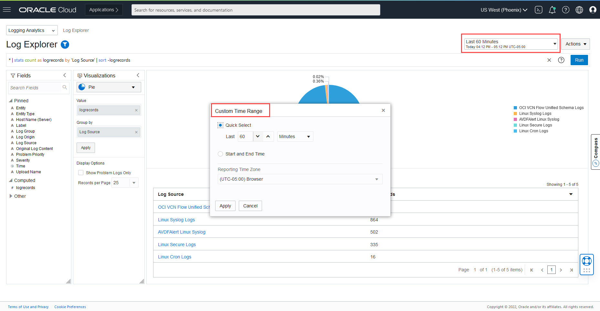
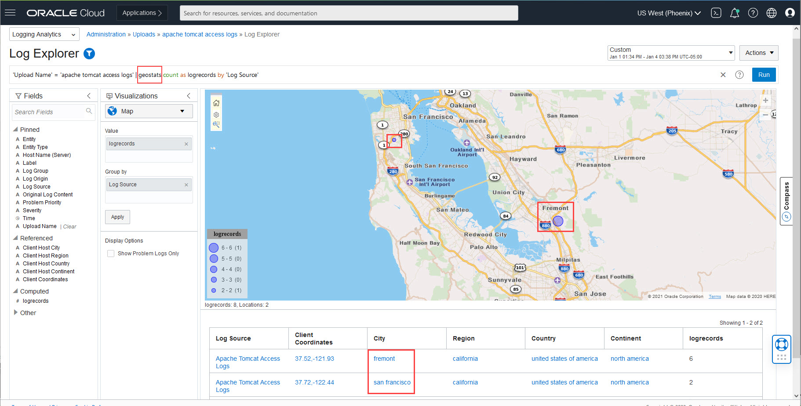
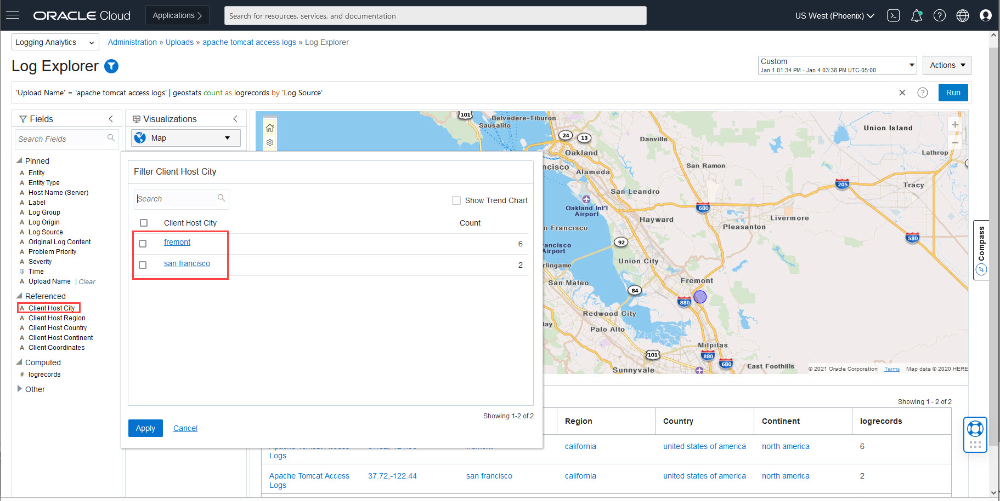

# View and Analyse Geolocation Enriched data in Map Visualization

## Introduction
You can use the Map visualization in Logging Analytics to view log records grouped by the location from where the logs are collected.

Estimated Lab Time: 10 documentation

### Objectives

In this lab, you will:
* Explore Geolocation Visualization
* Geolocation Analytics

### Prerequisites
* An Oracle Cloud Environment
* Working knowledge of OCI Logging Analytics and OCI in general.
* Logs ingested in Logging Analytics using Geolocation enabled Source eg. Source used in Lab 1 or Lab 2.

## **Task 1:**  Open Map Visualization
1. In the OCI Console, navigate to **Logging Analytics > Log Explorer** 

2. Set log search time range

3. In **Visualizations**, select **Map** visual

4. Drill down further using various Geolocation fields

## Acknowledgements
* **Author** - Sachin Mirajkar, Logging Analytics Development Team
* **Contributors** -  Kumar Varun, Logging Analytics Product Management, Jolly Kundu - Logging Analytics Development Team
* **Last Updated By/Date** - Jan 12 2022
