# Geolocation Enrichment for Private IPs

## Introduction

In Lab 1, you saw how to enrich Geolocation data for Public IPs. This lab covers setting up Logging Analytics resources such as Lookup and Source to achieve Geolocation enrichment for both Private and Public IPs.
Complete use case is provided in [Geolocation Blog for Private IPs](https.blogs.oracle.com).

Estimated Lab Time: 30 minutes

### Objectives

In this lab, you will:
* Create a Lookup to map Private and Public IPs.
* Configure `Apache Tomcat Access Logs` Log Source to setup Geolocation enrichment.

### Prerequisites

* An Oracle Cloud Environment
* Working knowledge of OCI Logging Analytics and OCI in general.


Now we will walk through creating a Lookup and configuring Source for Geolocation Enrichment.

## **Task 1:**  Understanding Private Public IP mapping for Logging Analytics
Most of us connect to business applications or services after connecting to a Virtual Private Network (VPN). When a user connects to VPN, a Private IP is assigned to their device. From this point on, all communication to and from user’s device is routed through VPN services Public IP address. Which in turn could be the Public IP for 100-1000s of devices.</br>
When user connects to VPN, the server access log shows client's Private IP address for API requests. This creates challenge in Geolocation Enrichment as Geolocation data cannot be extracted from Private IPs. To overcome this, we need information about how these Private IPs are mapped to a single Public IP.
Network Administrators maintain Private and Public IPs map to be used by their VPN service. We can leverage this mapping to enrich Geolocation information in Logging Analytics.

Take an example of Rideshare Inc., an imaginary company for discussion purpose. It has offices around the world and employees can connect to the office network via nearest VPN server.</br>
When its employee connects to VPN, the service assigns a Private IP from a dedicated pool. Say an employee connects to VPN via Freemont, CA server whose Public IP is 162.244.33.211. For this connection, the service assigns Private IP as 172.16.255.28</br>
Rideshare Inc's network administrators maintain the Private Public IP mapping as below:
> **Note:** For actual details, contact your network administrator to get the Private and Public IP address mapping.
| Private IP |  Public IP |
| --- | --- |
| 172.16.\*.\* | 162.244.33.211 |
| 172.17.\*.\* | 52.160.225.16 |
| 172.18.\*.\* | 192.241.211.91 |

Observe that they have used first 2 octets of Private IP to map the given Public IP.

Great, now we know the IP mappings and we can proceed to next step. Here we will use this critical information to generate Logging Analytics Lookup table.

## **Task 2:**  Create Lookup in Logging Analytics
Lookup allows you to match field-value combinations from Source to an external Lookup table, and if matched, the service appends field-value combinations to the log.</br>
For this task, we will be creating a **Simple** Lookup.</br>
Additional details are available in [Lookup documentation](https://docs.oracle.com/en-us/iaas/logging-analytics/doc/manage-lookups.html)

Lookup is created using a Comma Separated Values (csv) file. You will use the mapping table provided by your Network Administrator and create the file.

1. First create a Comma Separated Values (csv) file containing Private-Public IP mappings. </br>
Here is a [sample lookup file](./images/private-public-ip-mapping.csv)
    > **Note:** We have used only first 2 octets of Private IP as remaining 2 are variables.
    ```
    Relationship_ID,Public_IP
    172.16,162.244.33.211
    172.17,52.160.225.16
    172.18,192.241.211.91
    ```

2. In the OCI Console, navigate to **Logging Analytics > Administration > Lookups**</br>
    Here you will find Oracle-defined Lookups, but for this Lab we are going to create a custom Lookup.
    Now click **Create Lookup** button to open Lookup creation dialog.
     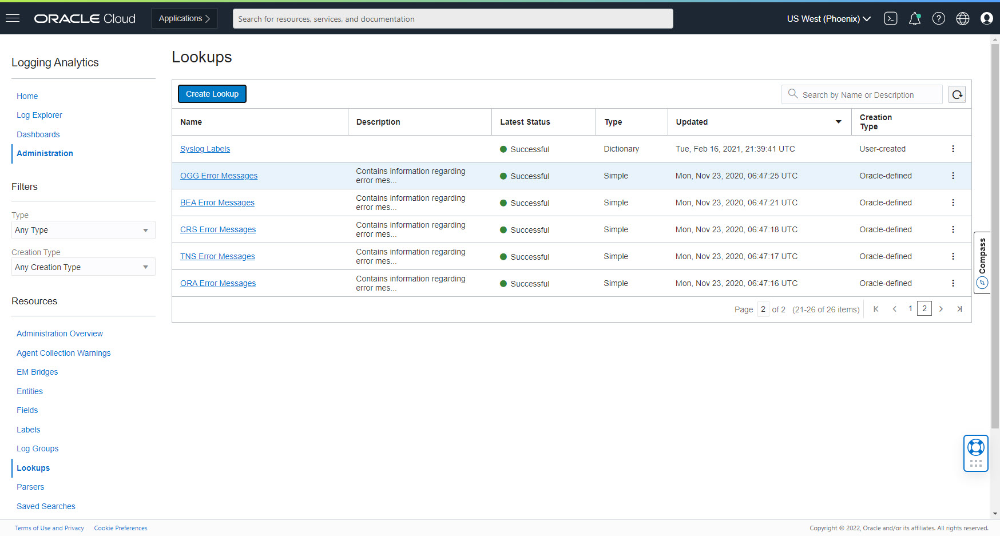

3. Configure Lookup

    a. Give **Name** as `Private Public IP Map`

    b. Give **Description** as `Lookup for Private-Public IP Mapping`.

    c. Select **Type** as `Simple`.

    d. Select **File** as csv mapping file that you created above.

    e. Click **Create**</br>
        It will take you back to Lookup listing page where you will see newly added Lookup `Private Public IP Map`
        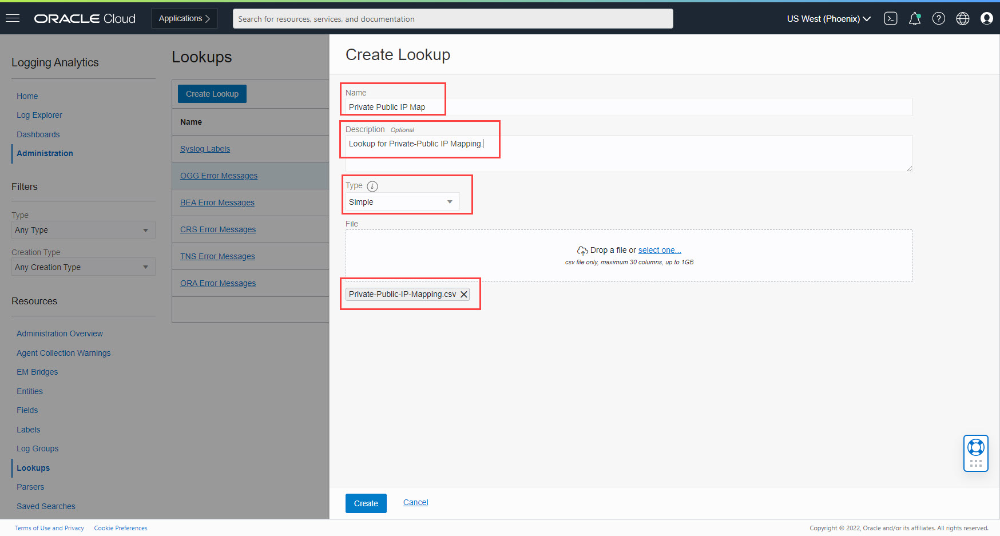

    f. Wait till Lookup creation is successful.
        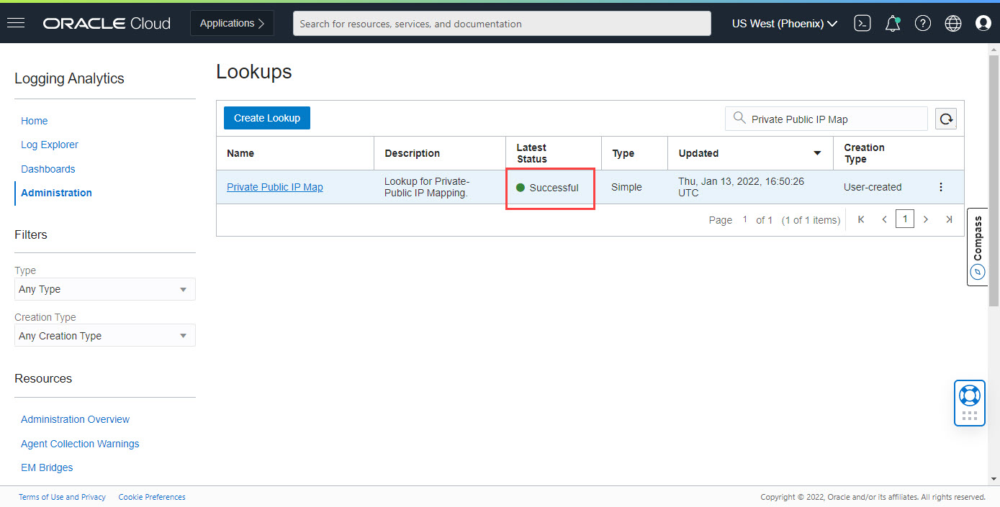

    g. In Lookups listing page, click on `Private Public IP Map` **Lookup**</br>
        Verify **Lookup Table** shows imported csv data.</br>
        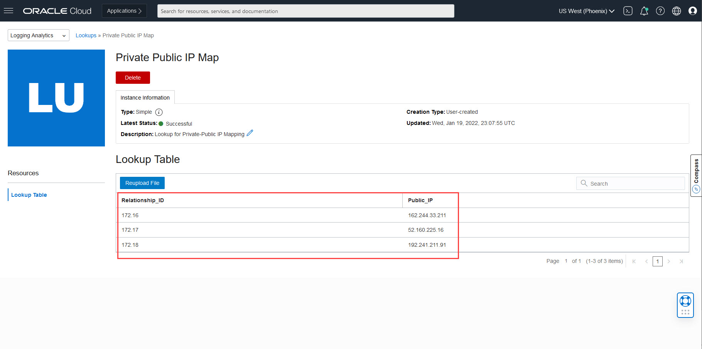
> **Note:** It may take up to 5 minutes to process the Lookup data.
        <comment>check if the note can be moved above image</comment>

## **Task 3:**  Configure Log Source
In this task, you will configure a Log Source to add Extended Fields and Field Enrichment.

1. In the OCI Console, navigate to **OCI Logging Analytics > Administration > Sources** and search `Apache Tomcat Access Logs` Source.
     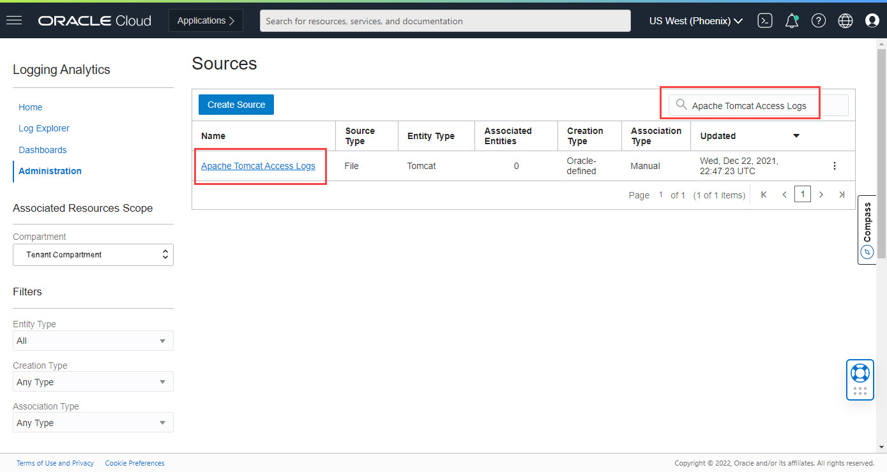

2. Edit the Source by clicking three dots in the row of our Source and click **Edit** menu item.
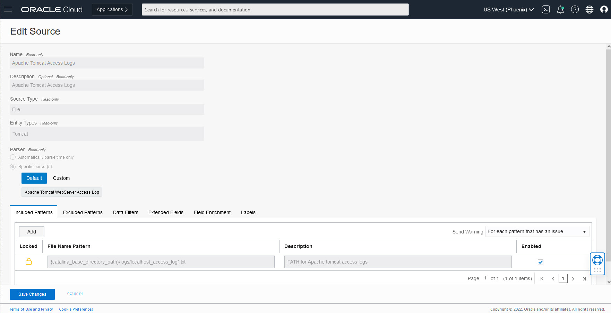

3. Click **Extended Fields** tab and add 2 Fields.</br>
    We will create **Relationship ID** and **Public IP** fields from contents of Source Field **Host IP Address (Client)**.</br>
    Lets create **Relationship ID** which will contain first 2 octets from **Host IP Address (Client)**.</br>
      a. Click **Add** button to open popup</br>
      b. Select **Base Field** as **Host IP Address (Client)**.</br>
      c. Type **Example Base Field Content** as `172.17.38.179`</br>
      d. Type **Extract Expression** as `{Relationship ID:\d+.\d+}`</br>
      e. Click **Test Definition** and verify **Relationship ID** in **Test Results** table. Ignore any warnings.</br>
      f. Click **Save** to add the entry.
      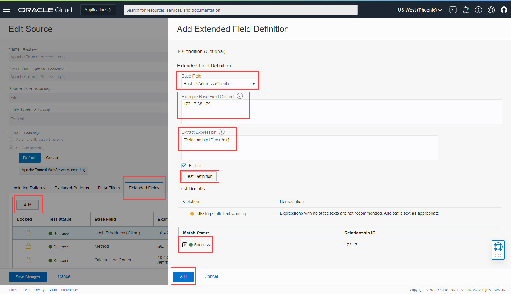
      Now create the **Public IP** Field from **Host IP Address (Client)**.</br>
      g. Click **Add** button to open popup.</br>
      h. Select **Base Field** as **Host IP Address (Client)**.</br>
      i. Type **Example Base Field Content** as `172.16.138.209`</br>
      j. Type **Extract Expression** as `{Public IP:\S+}`</br>
      k. Click **Test Definition** and verify **Public IP** in **Test Results** table. Ignore any warnings.</br>
      l. Click **Save** to add the entry.
      
   Observe newly added 2 rows in **Extended Fields** tab
  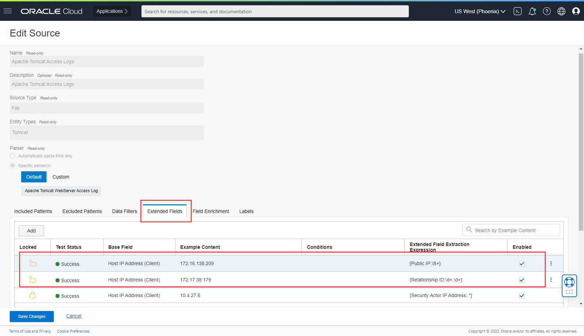

4. Click **Field Enrichment** tab and add  **Lookup** and **Geolocation** entries in given order.</br>
    First, We will add **Lookup** Function.</br>
      a. Click **Add** button.</br>
      b. Select **Function** as **Lookup**.</br>
      c. Select **Lookup Table Name** as **Private Public IP Map**.</br>
      d. In **Input Fields** select **Lookup Table Column** as **Relationship\_ID** and **Log Source Field** as **Relationship ID**.</br>
      e. In **Output Fields** select **Lookup Table Column** as **Public_IP** and **Log Source Field** as **Public IP**.</br>
      f. Click **Save Changes** button.</br>
      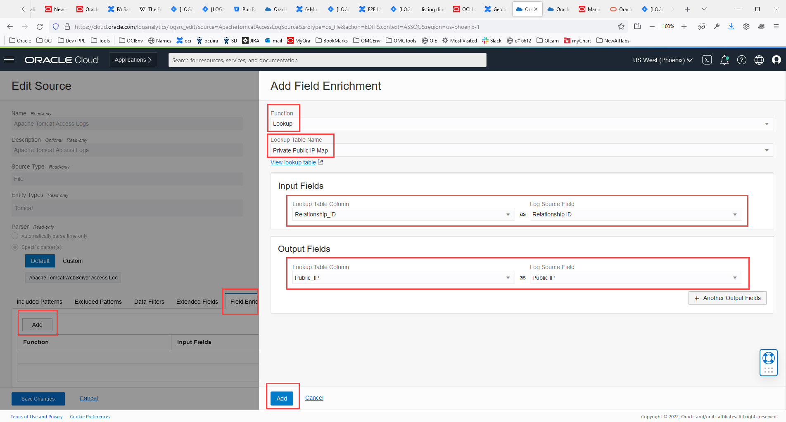
      Now we will add **Geolocation** Function.</br>
      g. Click **Add** button.</br>
      h. Select **Function** as **Geolocation**.</br>
      i. In **Input Fields** select **IP Address Field** as **Public IP**.</br>
      j. Click **Save Changes** button.</br>
      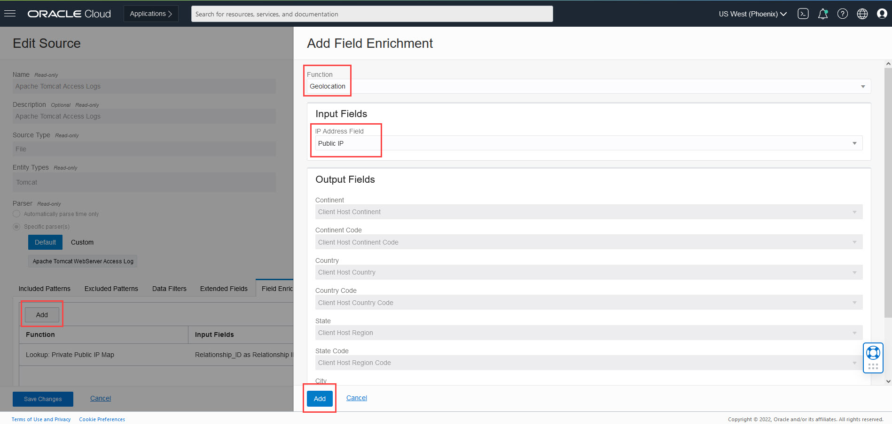
      Observe 2 new rows in **Extended Fields** tab with **Lookup** in first row and **Geolocation** in second row.
      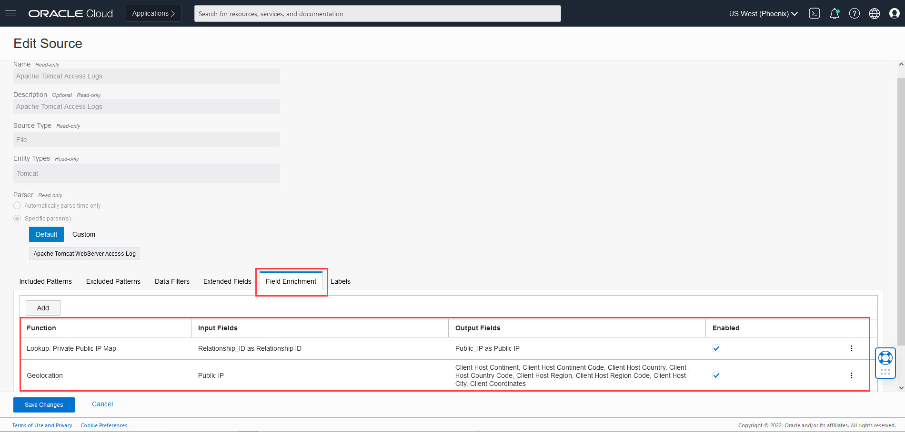

  5. Click **Save Changes** to save Source.

> **Important Note:** After saving the Source, it takes up to 10 minutes to refresh it on server. Any logs ingested meanwhile will use old version of the Source.

This completes the Administration changes for Geolocation Enrichment.

You may now proceed to the next lab.

## Acknowledgements
* **Author** - Sachin Mirajkar, Logging Analytics Development Team
* **Contributors** -  Kumar Varun, Logging Analytics Product Management, Jolly Kundu - Logging Analytics Development Team
* **Last Updated By/Date** - Jan 12 2022
