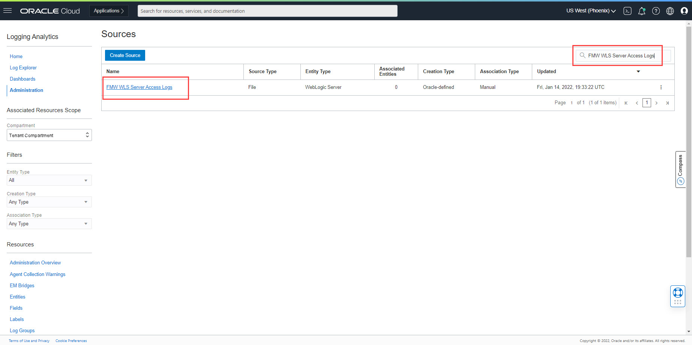
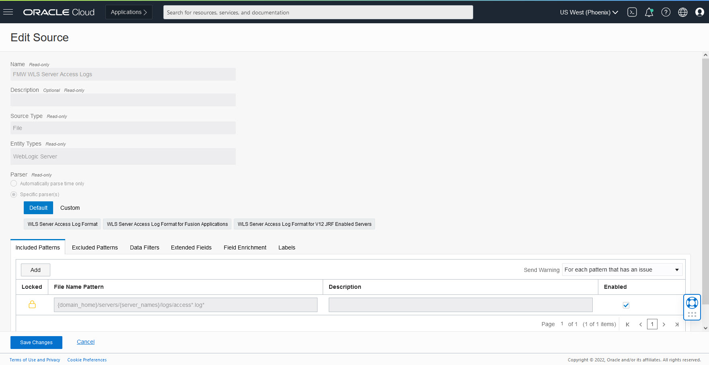
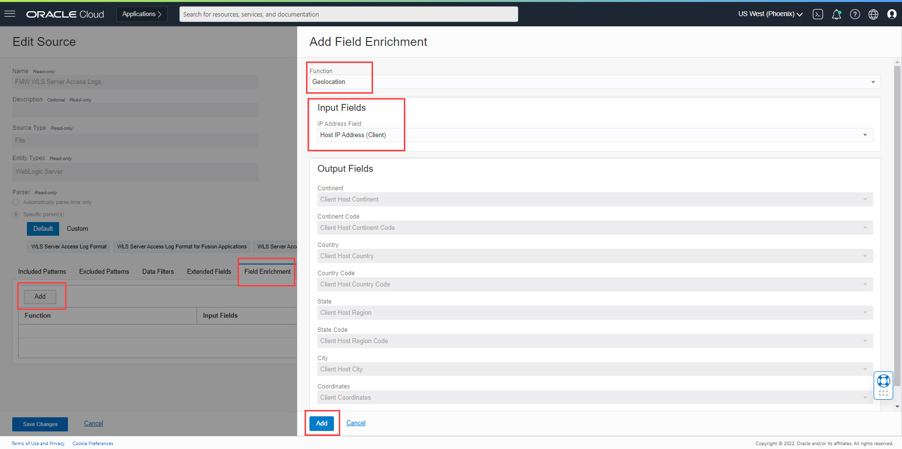
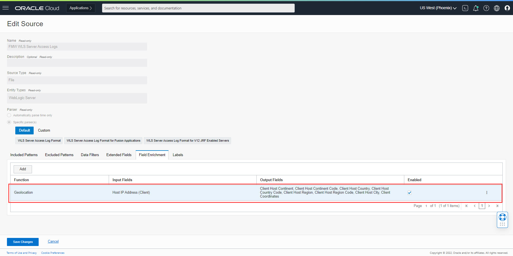

# Geolocation Enrichment for Public IPs

## Introduction

This lab covers setting up Logging Analytics Source to achieve Geolocation enrichment for Public IP addresses.
Complete use case is provided in [Geolocation Blog for Private IPs](https.blogs.oracle.com)

Estimated Lab Time: 30 minutes

### Objectives

In this lab, you will:
* Configure `FMW WLS Server Access Logs` Log Source to setup Geolocation enrichment.

### Prerequisites

* An Oracle Cloud Environment
* Working knowledge of OCI Logging Analytics and OCI in general.

Now we will walk through creating a Lookup and configuring Source for Geolocation Enrichment.

## **Task 1:**  Configure Log Source
In this task, you will configure a Log Source to add Field Enrichment for Geolocation.

1. In the OCI Console navigate to **Logging Analytics > Administration > Sources** and search `FMW WLS Server Access Logs` Source.

2. Edit the Source by clicking three dots in the row of our Source and click **Edit** menu item.

3. Click **Field Enrichment** tab and add Geolocation entry. 
      a. Click **Add** button. 
      b. Select **Function** as **Geolocation**. 
      c. In **Input Fields** select **IP Address Field** as **Host IP Address (Client)**. 
      d. Click **Save Changes** button. 
      
      Observe new row in **Field Enrichment** tab
      

  5. Click **Save Changes** to save Source.

> **Important Note:** After saving the Source, it takes up to 10 minutes to refresh it on server. Any logs ingested meanwhile will use old version of the Source.

This completes the Administration changes for Geolocation Enrichment.

You may now proceed to the next lab.

## Acknowledgements
* **Author** - Sachin Mirajkar, Logging Analytics Development Team
* **Contributors** -  Kumar Varun, Logging Analytics Product Management, Jolly Kundu - Logging Analytics Development Team
* **Last Updated By/Date** - Jan 12 2022
