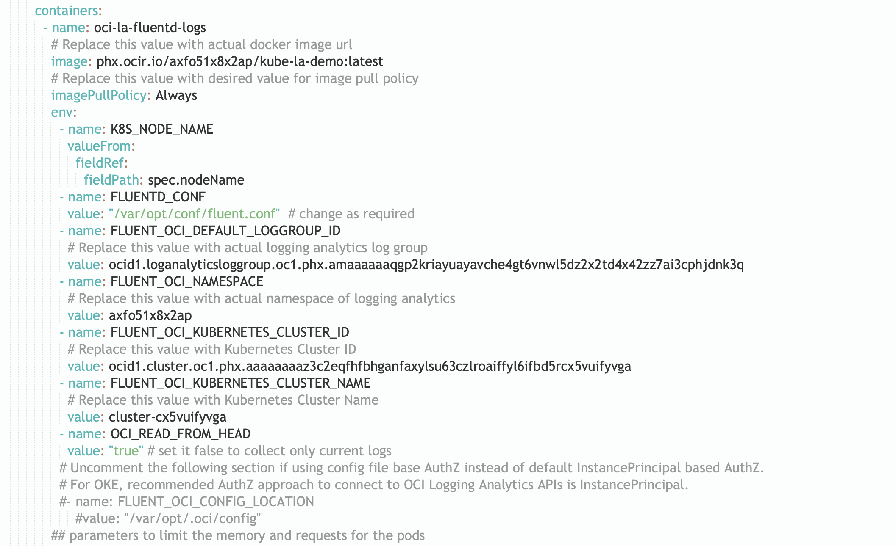
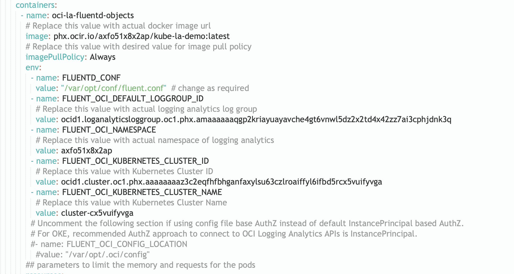

# Introduction

This lab walks you through the yaml files needed for the logs and objects monitoring and to provide an end-to-end solution for customers to monitor Oracle Container Engine for Kubernetes (OKE) through Logging Analytics.

More information about Kubernetes architecture can be found below,
[here](https://kubernetes.io/docs/concepts/overview/components/)


Estimated Lab Time: 15 minutes


## Objectives

In this lab, you will learn about:
* Create/Setup yaml files for log Monitoring
* Create/Setup yaml files for Objects Monitoring
* Fluentd output plugin files


## **STEP 1:** Onboard Logging Analytics

  1. Enable Logging Analytics
    - If not already done , refer to the [document](https://docs.oracle.com/en-us/iaas/logging-analytics/doc/configure-your-service.html)

  2. Setup dynamic group
    - Refer [this](https://docs.oracle.com/en-us/iaas/Content/Identity/Tasks/managingdynamicgroups.htm) for details about managing dynamic groups.
    - Add the following rule:
      All {resource.type = '', resource.compartment.id = 'Compartment OCID'}

  3. Create Logging Analytics Policy
    - For InstancePrincipal based AuthZ to work from OKE Fluentd, once necessary dynamic-group(s) is(are) created, the following policy is required.

    Allow dynamic-group (dynamic groupname) to {LOG ANALYTICS LOG GROUP UPLOAD LOGS} in compartment (compartmentname)

## **STEP 2:** Yaml files creation for Log collection

  This section describes the installation of OKE Monitoring solution of Logging Analytics using kubectl based approach.
  At present, we support InstancePrincipal and OCI Config File (UserPrincipal) based AuthZ for Fluentd to talk to OCI Logging Analytics APIs.
  We recommend to use InstancePrincipal based AuthZ for OKE and all clusters which are running on OCI VMs.

  In this method , the following yaml files are needed.
    - configmap-docker.yaml/configmap-cri.yaml
    - fluentd-daemonset_masked.yaml

  **configMap.yaml**

  - This file contains all the Out of the box fluentd configuration provided by the oci logging analytics that should work for OKE, EKS. The log locations may differ for other Kubernetes clusters and need modification to the Fluentd configuration accordingly.
  - This file includes collection configuration for OKE System/Component Logs like Kube Proxy, Autoscaler etc., and Linux System Logs like Syslog, Cronlog etc., and for all container logs in /var/log/containers/.
  - We have defined and configured OOB Source/Parsers for each of the Log type in the configuration.
  - A generic source is defined/configured for collecting application container logs. We recommend to define/use Log Source/Parser at Logging Analytics for a given log type and then create corresponding Fluentd config (Source, Filter section) to get those logs parsed properly.
  - Also, this file is available in 2 formats,  one for Docker based runtime (OKE clusters < 1.20) and the other for CRI-O (OKE 1.20 and above) based runtime. Use the appropriate one according to the runtime.
  - Inline comments are available in the file for each of the source/filter/match block for reference.

    **NOTE** : When adding new configuration (Source, Filter section) for any new container log, exclude the log path from generic log collection by adding the log path to exclude path field in tail containerlogs source block. This is to avoid the duplicate collection through generic log collection.

  Click [here](https://docs.oracle.com/en/learn/oci_logging_analytics_fluentd/#buffer-configuration-parameters) to know more about each of the configuration fields.

  **fluentd-daemonset_masked.yaml**

  - This file has all the necessary components to deploy Fluentd along with necessary plugins including OCI Logging Analytics Output Plugin as a Kubernetes Daemonset.
  - At minimum, (IMAGE URL), (DEFUALT LOGGROUP ID), (TENANCY NAMESPACE) needs to updated (for InstancePrincipal based AuthZ).
  - Sample screenshot of the updated fluentd-daemonset_masked.yaml file
  


**Commands Reference**

Let us access the OKE cluster . Refer [document](https://docs.oracle.com/en-us/iaas/Content/ContEng/Tasks/contengcreatingclusterusingoke.htm) on creating the cluster.

  ```
  $ oci -v
  3.3.2
  $ mkdir -p $HOME/.kube
  $ oci ce cluster create-kubeconfig --cluster-id <cluster_id> --file $HOME/.kube/config --region us-phoenix-1 --token-version 2.0.0  --kube-endpoint PUBLIC_ENDPOINT
  Existing Kubeconfig file found at /Users/asasr/.kube/config and new config merged into it
  $ kubectl apply -f configmap-docker.yaml
  configmap/oci-la-fluentd-logs-configmap created
  $ kubectl apply -f fluentd-daemonset_masked.yaml
  serviceaccount/oci-la-fluentd-serviceaccount created
  clusterrole.rbac.authorization.k8s.io/oci-la-fluentd-logs-clusterrole created
  clusterrolebinding.rbac.authorization.k8s.io/oci-la-fluentd-logs-clusterrolebinding created
  daemonset.apps/oci-la-fluentd-daemonset created
  ```
  ```
  $ kubectl get daemonsets -n=kube-system
  NAME                       DESIRED   CURRENT   READY   UP-TO-DATE   AVAILABLE   NODE SELECTOR                       AGE
  csi-oci-node               3         3         3       3            3           <none>                              60m
  kube-flannel-ds            3         3         3       3            3           <none>                              60m
  kube-proxy                 3         3         3       3            3           beta.kubernetes.io/os=linux         60m
  nvidia-gpu-device-plugin   0         0         0       0            0           <none>                              60m
  oci-la-fluentd-daemonset   3         3         3       3            3           <none>                              65s
  proxymux-client            3         3         3       3            3           node.info.ds_proxymux_client=true   60m
  ```

Sample files can be found [here](https://github.com/oracle-quickstart/oci-kubernetes-monitoring/tree/main/logan/kubernetes-resources/logs-collection)

## **STEP 3:** Yaml files creation for Objects collection

  In this method , the following yaml files are needed.
    - configmap-objects.yaml
    - fluentd-deployment_masked.yaml

  **configMap.yaml**
  - This file contains all the Out of the box fluentd configuration provided by the oci logging analytics for collecting some of the Kubernetes Objects.

  **fluentd-deployment_masked.yaml**
  - This file has all the necessary components to deploy Fluentd along with necessary plugins including OCI Logging Analytics Output Plugin as a Kubernetes Deployment (with 1 replicas).
  - Make sure to replace the fields with actual values before deploying. At minimum (IMAGE URL), (DEFUALT LOGGROUP ID), (TENANCY NAMESPACE) needs to updated (for InstancePrincipal based AuthZ).
  - Sample screenshot of the updated fluentd-deployment_masked.yaml file
  


  **Commands Reference**

  Let us access the OKE cluster . Refer [document](https://docs.oracle.com/en-us/iaas/Content/ContEng/Tasks/contengcreatingclusterusingoke.htm) on creating the cluster.

    ```
    $ kubectl apply -f configmap-objects.yaml
    configmap/oci-la-fluentd-objects-configmap created
    $ kubectl apply -f fluentd-deployment_masked.yaml
    serviceaccount/oci-la-fluentd-serviceaccount unchanged
    clusterrole.rbac.authorization.k8s.io/oci-la-fluentd-objects-clusterrole created
    clusterrolebinding.rbac.authorization.k8s.io/oci-la-fluentd-objects-clusterrolebinding created
    deployment.apps/oci-la-fluentd-deployment created
    ```
    ```
    $ kubectl get deployments -n=kube-system
    NAME                        READY   UP-TO-DATE   AVAILABLE   AGE
    coredns                     3/3     3            3           59m
    kube-dns-autoscaler         1/1     1            1           59m
    oci-la-fluentd-deployment   1/1     1            1           17s
    ```
Sample files can be found [here](https://github.com/oracle-quickstart/oci-kubernetes-monitoring/tree/main/logan/kubernetes-resources/objects-collection)

You may now [proceed to the next lab](#next).


## Acknowledgements
* **Author** - Ashwini R, Senior Member of Technical Staff
* **Contributors** -  Kumar Varun, Product Manager
* **Last Updated By/Date** - <Name, Group, Month Year>
