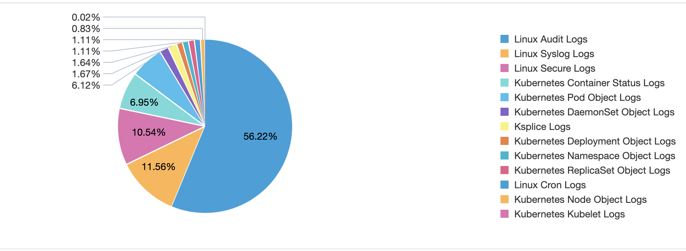
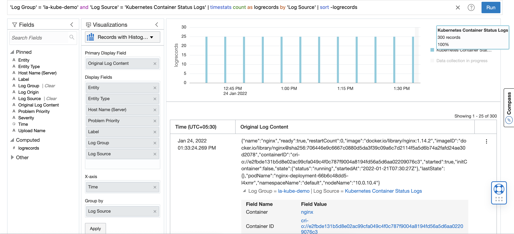
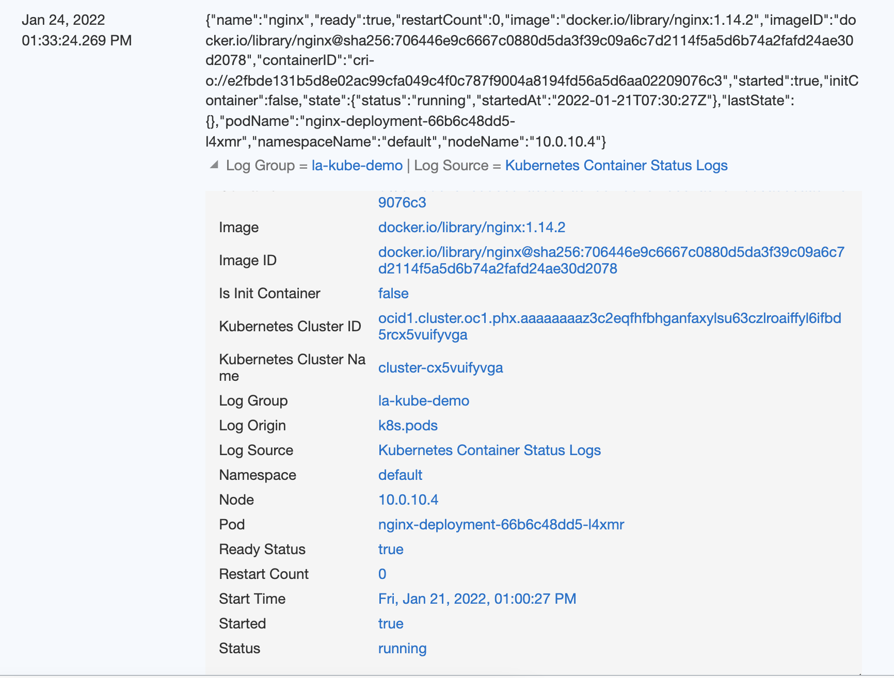
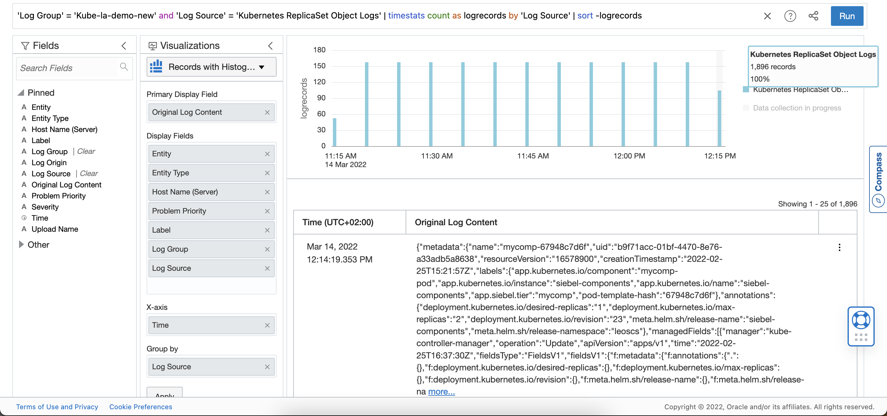
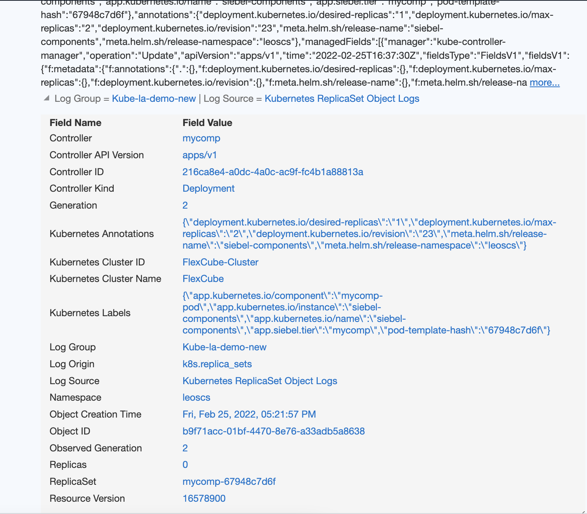

# Introduction

This lab walks you through the steps to see the logs getting collected in Logging Analytics.

Estimated Lab Time: 10 minutes

## Objectives

In this lab, you will:
* View the logs collected in Logging Analytics
* Analyse the kubeneters system logs
* Analyse the kubernetes object logs

## **STEP 1**: Logs in Logging Analytics

Once the deployment is completed using the yaml files , you can view the logs in Logging Analytics console.

  1. Login to OCI console.
  2. Navigate to Observability & Management -> Logging Analytics -> Log Explorer
  3. You can now view the logs getting collected as below,
     

## **STEP 2**: Analyse the kubernetes system logs

  1. Let us now view the system/service logs from OKE environment.
  In the below example let us consider the Kubernetes Container Status Logs ,
  
  2. We can see the status log , from the log explorer view and get the details of the Container.
  

## **STEP 3**: Analyse the kubernetes object logs

  1. Let us now view the object logs from OKE environment.
  In the below example let us consider the Kubernetes ReplicaSet Object Logs ,
  
  2. We can see the object log , from the log explorer view and get the details of the ReplicaSet.
  

  
You may now [proceed to the next lab](#next).

## Learn More

* Link to github for sample helm charts

* [URL text 1](http://docs.oracle.com)
* [URL text 2](http://docs.oracle.com)

## Acknowledgements
* **Author** - Ashwini R, Senior Member of Technical Staff
* **Contributors** -  Kumar Varun, Product Manager
* **Last Updated By/Date** - <Name, Group, Month Year>
