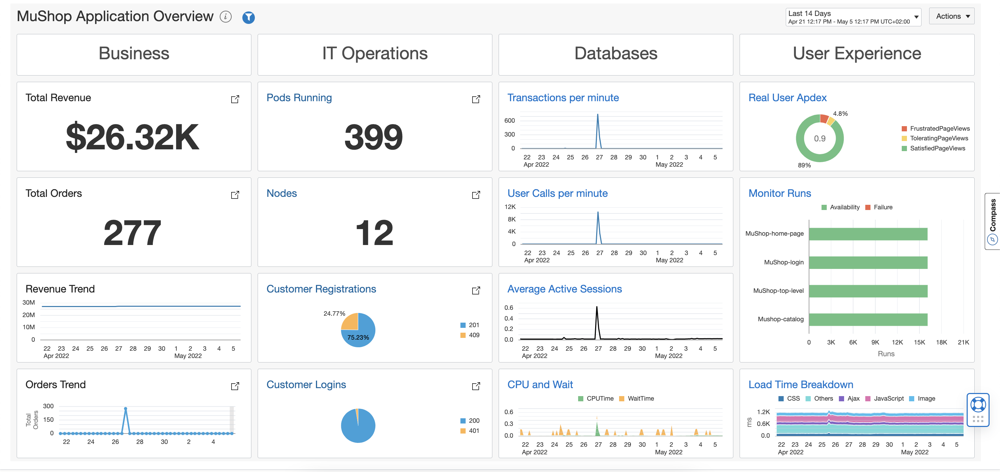
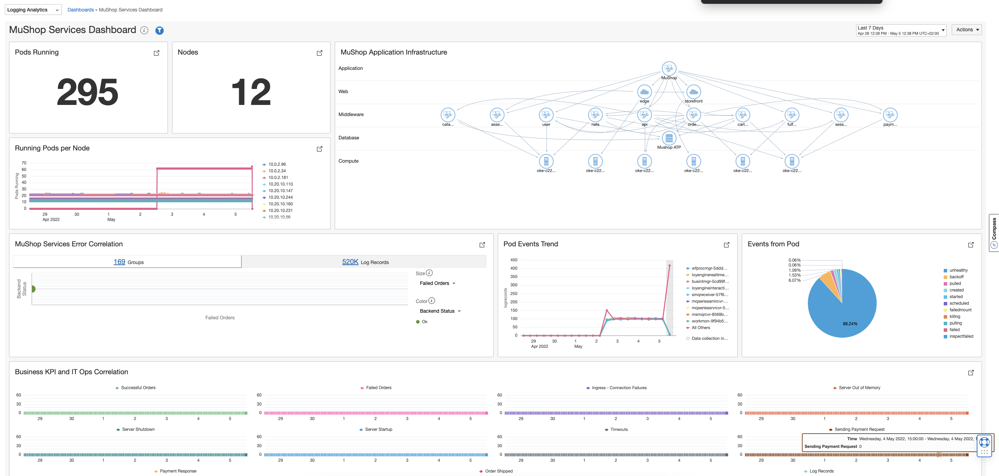
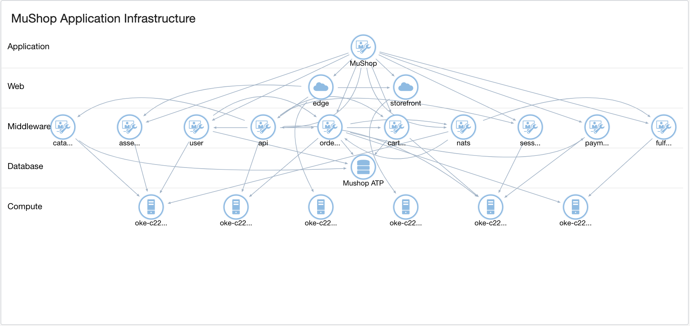

# Introduction

This lab walks you through the steps to search and analyse the logs of OKE using Dashboard.

Estimated Lab Time: n minutes

## Objectives

In this lab, you will:
* Overview of Dashboard.
* Unified Dashboard with O&M services.
* Analyse OKE logs from Dashboard using Logging Analytics.

### Prerequisites

* Same as specified in the introduction section

## **STEP 1** : Overview of Dashboard

A dashboard is a collection of saved searches (widgets) on a single page, which provides quick access to multiple data analyses. With the required permissions, you can use Oracle-defined dashboards or create custom dashboards and use them to save and access the information specific to your needs and analyze the data by various dimensions.
More details can be found [here](https://docs.oracle.com/en-us/iaas/logging-analytics/doc/configure-management-dashboard.html#GUID-2082E86D-2088-4FBD-80D8-F73B0F0BF342)

## **STEP 2** : Unified Dashboard with O&M services

With the help of management dashboard we can create unified dashboard with all the O&M services this helps in making use of the features of O&M services which helps in analyzing the issues in the OKE environment in a more holistic way.
Below is the dashboard with all the OKE services for analysing OKE environments.

## **STEP 3** : Analyse OKE logs from Dashboard using Logging Analytics

Let us consider the dashboard from the Overview Dashboard.See the screenshot [above](images/OKE_overview.png)
In that the IT Operations section is created using Logging Analytics service.
For the OKE environment it displays the Number of Pods running , the Number of Nodes ,Customer Registrations and the Customer Logins.
Let us now click on the Pods Running link from the dashboard.It opens up the below dashboard which is Logging analytics service specific.

From this dashboard we can view Mushop Application Infrastructure overview running on this OKE environment.
With the help of Topology Viewer we can expand the entity configuration and view the composite entities, their dependents, and their relationships.

You may now [proceed to the next lab](#next).

## Learn More

* [Product Documentation](https://docs.oracle.com/en-us/iaas/logging-analytics/index.html)

## Acknowledgements
* **Author** - Ashwini R, Senior Member of Technical Staff
* **Contributors** -  Kumar Varun, Product Manager
* **Last Updated By/Date** - <Name, Group, Month Year>
