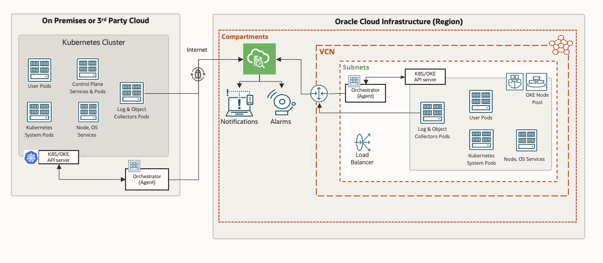

# Introduction

This workshop walks you through deploying Logging Analytics Kubernetes Monitoring Solution for Oracle OKE cluster. This monitoring solution is based on FluentD based Kubernetes Daemonset and Replica Sets for collecting Kubernetes platform logs, pods logs, and node logs. It also collects Kubernetes Object details on periodic basis. This workshop uses Oracle OKE for deployment for simplicity, but it can be similarly deployed for any Kubernetes environment.

## Logging Analytics Kubernetes Monitoring Solution Architecture

Details about the reference architecture can be found at [here](https://docs.oracle.com/solutions/?q=&cType=reference-architectures&sort=date-desc&lang=en).

### About Logging Analytics
Oracle Cloud Logging Analytics is a cloud solution in Oracle Cloud Infrastructure that lets you index, enrich, aggregate, explore, search, analyze, correlate, visualize and monitor all log data from your applications and system infrastructure

### Prerequisites

* An Oracle Free Tier, Always Free, Paid or LiveLabs Cloud Account
* Logging Analytics service is onboarded
* Familiarity with Logging Analytics concepts
* Access to an OKE Cluster with right permissions

You may now proceed to the [Getting Started lab](#next).

## Learn More

* [Blog](https://blogs.oracle.com)
* [Reference Architecture](ttps://docs.oracle.com/solutions/?q=&cType=reference-architectures&sort=date-desc&lang=en)
* [Product Documentation](https://docs.oracle.com/en-us/iaas/logging-analytics/index.html)

## Acknowledgements
* **Author** - Ashwini R, Senior Member of Technical Staff
* **Contributors** -  Kumar Varun, Product Manager
* **Last Updated** - January 12, 2022
